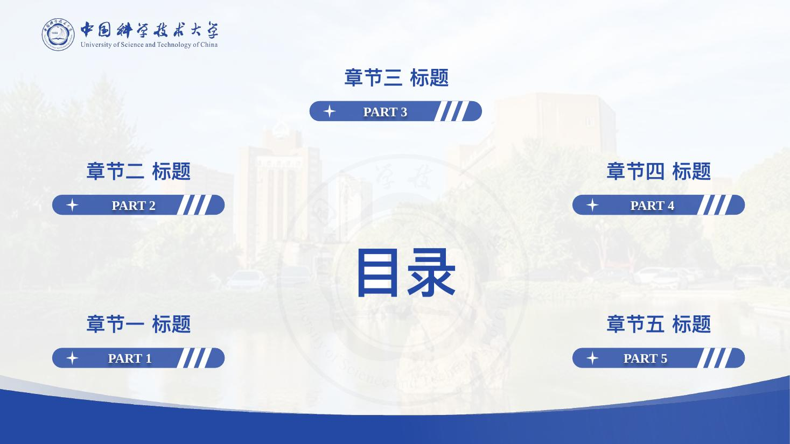
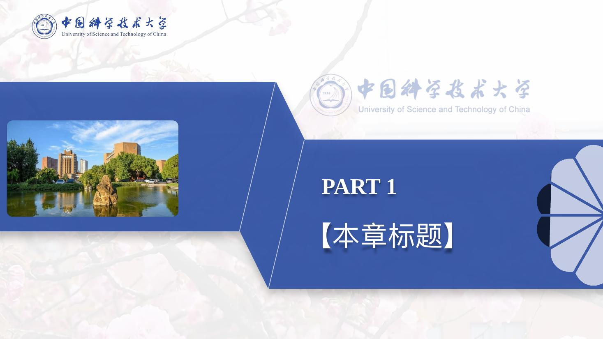
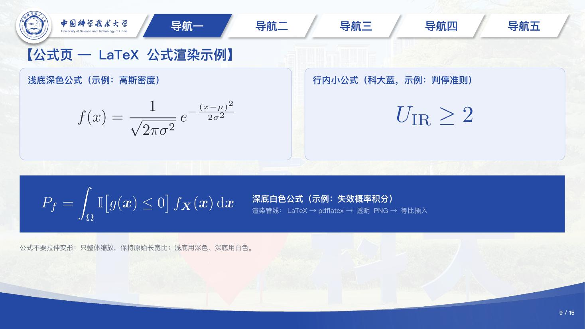
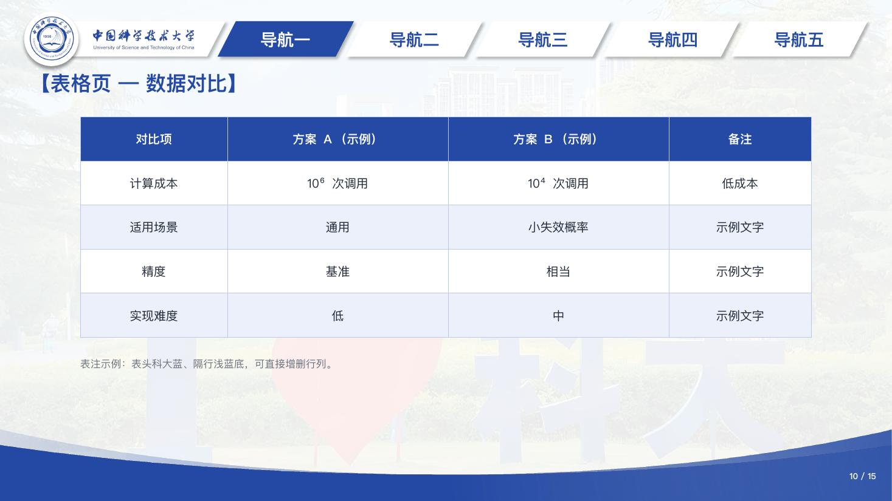

# USTC 蓝色学术 PPT 模版

A USTC-blue academic PowerPoint template with full hyperlink navigation, a LaTeX formula
pipeline, and Claude Code skills.

中国科学技术大学风格的蓝色学术汇报 PPT 模版（16:9，WPS / PowerPoint / LibreOffice 通用），
适用于组会汇报、开题、答辩等场景。

| 封面 | 目录（可点击跳转） | 章节转场 |
|---|---|---|
|  |  |  |

| 两栏图文 | 公式页 | 表格页 |
|---|---|---|
|  |  |  |

> 预览图由 LibreOffice 以替代字体渲染；实际打开时使用模版内嵌的方正小标宋 / 微软雅黑等字体，效果更佳。

## 特性

- **15 页完整骨架**：封面 / 目录 / 5 个章节转场页 / 密集内容示例页 / 6 种布局示例页（两栏图文、三卡片要点、数据指标、流程时间线、公式演示、表格）/ 致谢
- **129 处跳转超链接**：目录五项 → 各章节转场页；每个内容页顶部导航条 → 对应章节；页眉校徽 → 跳回目录。WPS 与 Office 行为一致
- **科大蓝 `#254AA5`** 全套配色（取自校徽标准色），衍生色板见 [skills/ustc-ppt-template/SKILL.md](skills/ustc-ppt-template/SKILL.md)
- **内嵌中文字体**：方正小标宋、微软雅黑、华文中宋、汉仪颜楷——换电脑不跑版
- **LaTeX 公式管线**：`pdflatex → 透明 PNG → 等比插入`，浅底深字 / 深底白字，绝不拉伸
- **Claude Code skills**：配合 [Claude Code](https://claude.com/claude-code) 可一句话完成"用模版把这份内容做成 PPT""把公式渲染了"

## 直接使用

下载 [`template/模板_USTC蓝色学术_v1.pptx`](template/)，用 WPS 或 PowerPoint 打开：

1. 第 5–10 页是六种"布局母版"，需要哪种就**复制该页**再填内容，别在原页上改
2. 所有【】与"（示例）"文字均为占位符；顶部"导航一~五"改成你的章节名
3. 增删章节后，重跑接线脚本恢复全部跳转：
   ```bash
   python3 scripts/wire_nav_links.py 你的文件.pptx
   ```
4. 插入公式：
   ```bash
   python3 scripts/render_formula.py 'P_f = \int_\Omega \mathbb{I}[g(x)\le 0]\,f_X(x)\,dx' out.png --color 1F2937 --display
   python3 scripts/insert_formula.py 你的文件.pptx 页码 out.png --box 2.0 1.5 4.0 1.0 --align ctr
   ```
   依赖：LaTeX（TinyTeX 即可，缺包 `tlmgr install standalone preview`）、poppler（`pdftoppm`）、Pillow、python-pptx

   **电脑里没有 LaTeX？两个办法：**
   - **在线渲染（零安装）**：打开 [latexlive.com](https://www.latexlive.com/home)，粘贴公式 →
     导出图片（选**透明背景**、最高分辨率/SVG 转 PNG）→ 插入 PPT。注意只整体等比缩放，
     **不要拖动边中点拉伸**；浅色底用深色公式、深色底用白色公式
   - **装一个轻量 LaTeX（约 5 分钟）**：安装 [TinyTeX](https://yihui.org/tinytex/)
     （`wget -qO- "https://yihui.org/tinytex/install-bin-unix.sh" | sh`，Windows 有对应 exe），
     再 `tlmgr install standalone preview amsmath` 即可跑上面的脚本

## 安装 Claude Code skills（可选）

```bash
cp -r skills/* ~/.claude/skills/
mkdir -p ~/.claude/skills/ustc-ppt-template/assets
cp template/*.pptx assets/*.{png,pdf,jpg} ~/.claude/skills/ustc-ppt-template/assets/
```

之后在 Claude Code 里直接说"用科大模版把这份大纲做成 PPT"或"把这个 PPT 里的公式渲染了"即可。

## 目录结构

```
template/   成品模版 pptx
assets/     校徽矢量与位图、校名字样、四张校园照片（16:9 裁剪版 + 原图）
scripts/    构建素材 / 配色迁移 / 新页生成 / 超链接接线 / 公式渲染与插入
skills/     两个 Claude Code skills（含完整使用文档与避坑记录）
preview/    预览图
```

技术细节（WPS 内嵌字体导致 LibreOffice 崩溃的绕过法、WPS 按文件名序号解析跳转、
组合级超链接不生效等实测坑）记录在 [skills/ustc-ppt-template/SKILL.md](skills/ustc-ppt-template/SKILL.md)。

## 致谢与声明

- 版式设计基于同学 **sjq** 制作的北京科技大学（USTB）模版改造，特此致谢（模版内保留
  "Designed by sjq" 署名）
- 本模版为**非官方**学生作品，与中国科学技术大学无隶属关系；校徽、校名字样版权归
  中国科学技术大学所有，仅供校内学习交流使用
- 校园照片仅作模版示例背景；如有权利问题请提 Issue，将立即更换
- 代码与脚本以 [MIT License](LICENSE) 发布；上述校徽、字样、照片素材**不在** MIT 授权范围内
